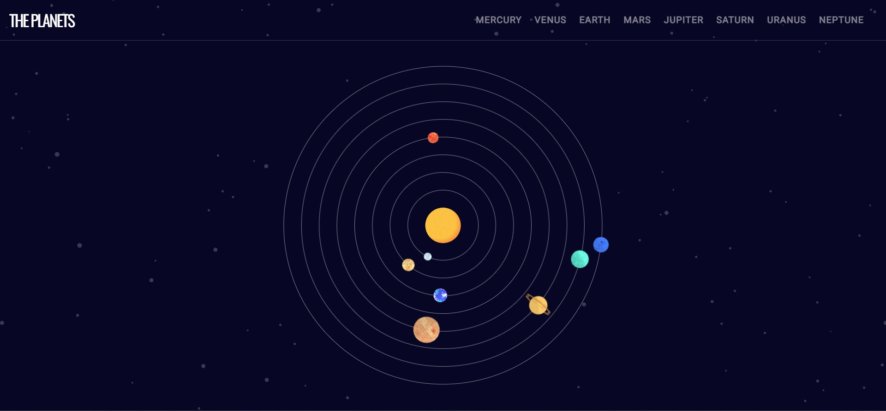
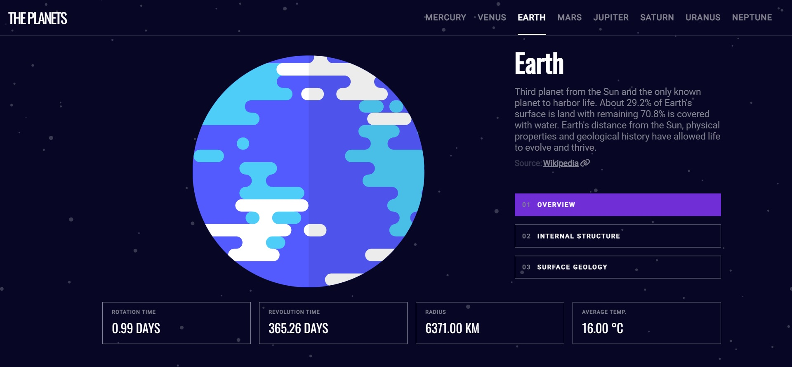
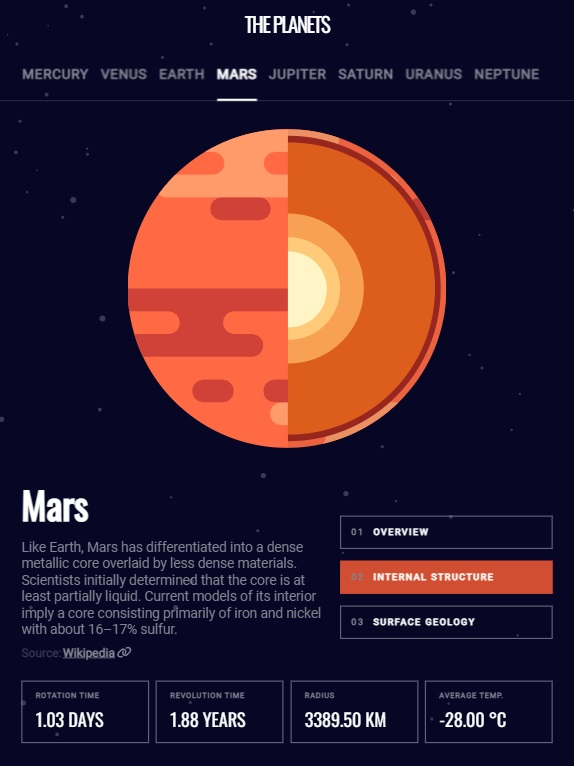
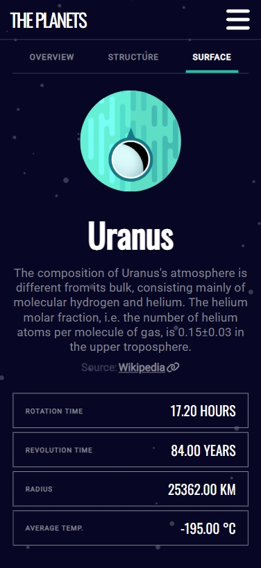

# Planets Facts
Planets Facts app is based on [Frontend Mentor](https://www.frontendmentor.io/home) challenge design. This project was a great opportunity to train React and Typescript skills. What's more, thanks to this project I've learned how to use Framer Motion library which is awesome tool to make animation in React.

## Table of contents
* [General info](#general-info)
* [Technologies](#technologies)
* [Live demo](#live-demo)
* [Screenshots](#screenshots)

## General info
Planets Facts is good source of knowledge about Solar System. You can find information about every planet orbiting the sun. Choose your planet and read about its structure, surface and more.

## Technologies
* TypeScript
* React
* React Router
* Framer Motion
* Sass
* Vite

## Live demo
[Click here](https://mobbyschiller.github.io/planets-facts/)

## Screenshots

